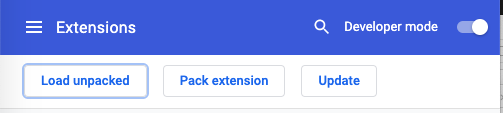
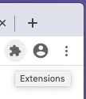
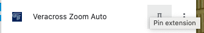
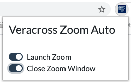
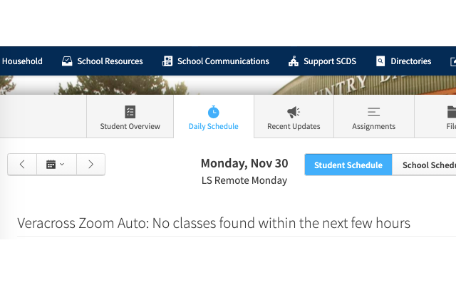
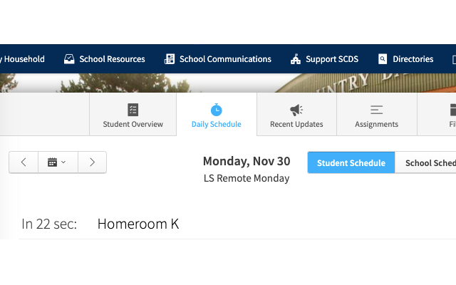

Veracross Zoom Auto
===================

Chrome extension to automatically launch Zoom link as the class starts from [Veracross website](https://www.veracross.com/).

# Installation
You can install it from this repo:
* Download this repo (click Code -> Download Zip on current page)
* Uncompress the zip file
* Go to [Chrome Extensions](chrome://extensions/) - [chrome://extensions/](chrome://extensions/)
* Enable Developer mode in top right corner

* 'Load unpacked', point to `VeracrossZoomAuto/src`

After installing, you need to enable it:
* Click on the Extensions button

* Pin the Veracross Zoom Auto extension

* Enable 'Launch Zoom' and 'Close Zoom Window'. The first option will result in launching Zoom link at the correct time, the secon in closing the Zoom window that is a byproduct of launching the link.

If everything works as expected, you should see a message on the student's Veracross portal saying:

If the extension finds the schedule with classes starting in the near future, it will change the message and launch the class Zoom link at the specified time:

If you want to have completely hands-off experience, you will need to approve the default settings for launching the zoom links in Chrome and audio settings in Zoom. Obviously, you will need to change the Veracross website to the appropriate day. 

